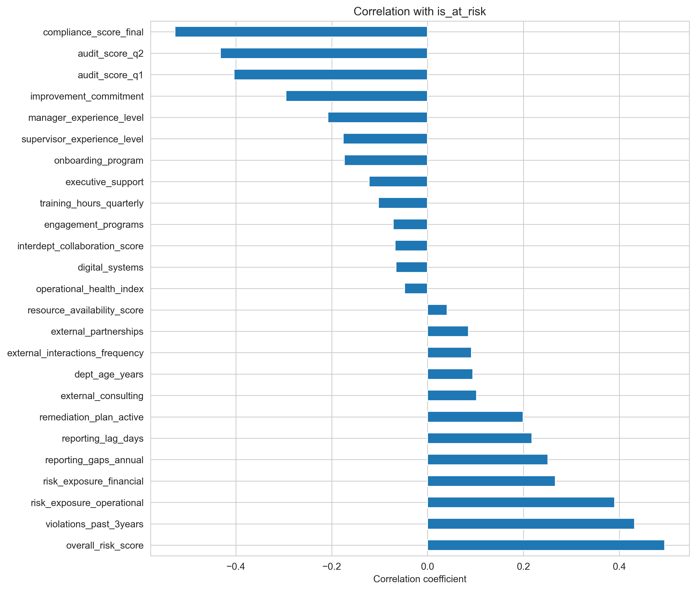
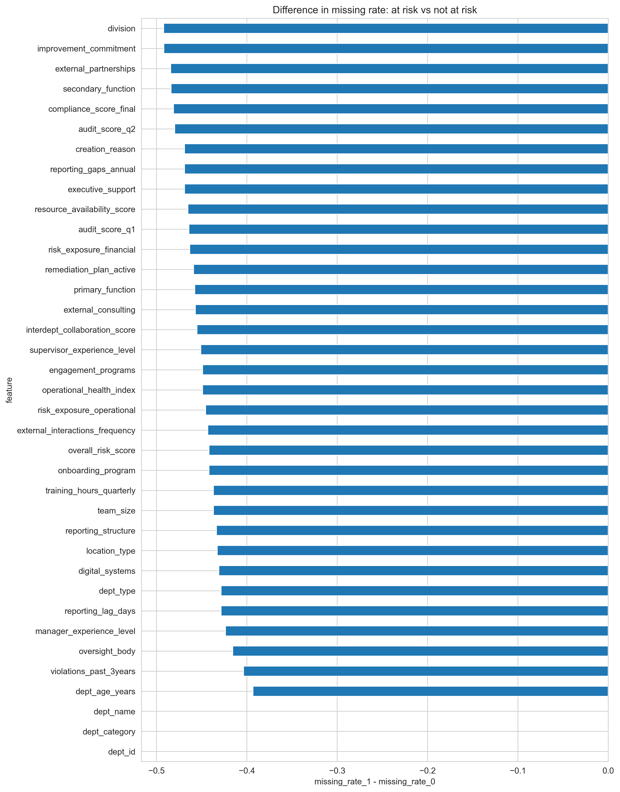

LUISS GUIDO CARLI
Undergraduate course of Management and Artificial Intelligence - 2nd Year
Machine Learning - Academic Year 2025/2026

# Compliance Radar

**Team Members**
Di Renzo Carla      ID 323411
Moriondo Tommaso    ID 316331
Pazienza Lorenzo    ID 308741
Raimondo Eleonora   ID 321521


# **[Section 1] Introduction**
This project develops a predictive and interpretive framework designed to identify potential compliance risks within an organisation.
Using the *org_compliance_data.db* dataset, which brings together operational, audit, reporting, financial, and employee-related indicators, 
the analysis aims to highlight departments that may be more exposed to compliance challenges and to characterize the organisational conditions
associated with such risks.

Formulated as a binary classification task with `is_at_risk` ∈ {0, 1}, the model achieves evidence-based insights intended
to strengthen internal accountability and support ethical, informed decision-making across the organisation.


# **[Section 2] Methods**

## **2.1 Dataset Analysis**
The dataset includes a wide range of departmental indicators, such as:
- Audit outcomes
- Operational exposures
- Governance support measures
- Reporting behavior
- Training participation
- Employee engagement metrics

Two structural factors strongly influence the methodological design:
1. **Class imbalance** in the target variable.
2. **Surveillance bias**, where at-risk departments show artificially lower missingness due to more intensive auditing.

This requires careful handling of missing values and strong leakage control.


## **2.2 Exploratory Data Analysis (EDA)**
The exploratory phase examines:

- Numerical variable distributions (histograms, box plots)
- Categorical frequency patterns
- Row-wise missingness scoring
- The relationship between missingness levels and risk status, reinforcing evidence of surveillance bias


### Figure 1 -- Correlation with the Target Variable
Below we report the Pearson correlations between each numerical feature and the target `is_at_risk`.

Strong negative correlations correspond to audit-related leakage, later removed from the modelling pipeline.

### Figure 2 -- Missingness Patterns and Surveillance Bias
Missing values differ systematically between at-risk and not-at-risk departments, confirming surveillance bias.

At-risk departments systematically show fewer missing values due to increased audit scrutiny.


## **2.3 Leakage Detection and Removal**
Data leakage is confirmed because compliance and audit scores act as post-evaluation outcomes rather than independent predictors, showing near-perfect separation between risk classes.
Furthermore, non-random missingness patterns betray the target, as high-risk departments rarely have missing data due to more frequent monitoring.


## **2.4 Pre-processing**

### **Data splitting (hold-out test set)**
We first create a **stratified train/test split** to preserve the class proportion of `is_at_risk` in both sets.  
All subsequent preprocessing steps are **fit on the training set only** and then applied to the test set, to avoid any test-set leakage.

### **Imputation (numeric features)**
After the split, missing values in **numerical** variables are imputed using simple, robust rules:

- **creation of missing flags** for each column: missing_flag = {0,1}, 1 if the features is missing for a department
- **Binary numerical variables** (0/1) → **Mode** imputation  
- **Ordinal variables** (discrete ordered scales) → **Median** imputation  
- **Continuous variables** → **Median** imputation  

> Note: scaling is performed later inside the model pipeline; imputation is performed before modeling, using parameters learned on the training split.

### **Categorical handling**
Missing values in categorical columns are treated as an **informative category**:
- `NaN` → `"Missing"`

### **Target encoding**
All categorical variables are converted into numeric form using **smoothed target encoding**, computed **only on the training set** and then mapped to the test set:

- Smoothing parameter: \(\alpha \approx 10\)  
- Unseen categories in the test set are mapped to the **global mean** risk rate observed in training.

This produces a set of `*_te` features, and the original object columns are removed before training.

### **Scaling**
For the **logistic regression**, numerical features are standardized using **z-score scaling** (`StandardScaler`) **inside the scikit-learn pipeline**, so scaling is learned within each CV training fold.


## **2.5 Leakage control and feature set**

Because the target is a **risk flag derived from a filtered “high-risk departments” list**, special care is needed to avoid including variables that directly encode audit outcomes or aggregated risk labels.

We explicitly removed **leak-prone** features (and their related engineered variants / flags), including:
- `audit_score_q1`, `audit_score_q2`
- `compliance_score_final` (declared as “primary target” in the dictionary, but not used as supervised target here)
- `overall_risk_score`
- engineered derivatives such as `audit_trend`, `audit_volatility`
- missing flags corresponding to the removed columns

This produces a final modeling table where:
- categorical variables are represented by **target-encoded** `*_te` features,
- numeric variables are imputed as described above,
- and **audit/outcome-style** fields are excluded to reduce leakage risk.


## **2.6 Model design and training pipeline**

### **Final selected model: Logistic Regression**
We select logistic regression as the **final baseline** because it offers:
- strong performance for tabular binary classification,
- **interpretability** (coefficients, odds ratios, SHAP for linear models),
- stable behavior under threshold tuning.

**Hyperparameter tuning** is performed with grid search over:
- \(C \in \{0.01, 0.1, 1, 10, 100\}\)
- solver/penalty combinations (e.g., `lbfgs` + \(\ell_2\); `liblinear` + \(\ell_1/\ell_2\))
- `class_weight` in \(\{\text{None}, \text{balanced}\}\)

The best configuration found for the final logistic regression was:
- penalty: \(\ell_2\)
- \(C = 0.01\)
- solver: `lbfgs`

### **Non-linear benchmark: XGBoost**
To test whether non-linear interactions provide meaningful gains, we also train an **XGBoost** classifier with randomized hyperparameter search on the training set, using stratified CV, and the same test-set validation protocol.


## **2.7 Cross-validation and evaluation protocol**

### **Cross-validation**
- Logistic Regression: **Stratified 10-fold CV** (grid search) on the training set  
- XGBoost: **Stratified 5-fold CV** (randomized search) on the training set  

### **Metrics**
Primary evaluation metric (model selection):
- **ROC-AUC**

Additional metrics reported on the **held-out test set**:
- Accuracy
- Precision / Recall / F1-score (with focus on class `is_at_risk = 1`)
- Confusion matrix
- ROC curve
- PR-AUC (when comparing models)

### **Decision-threshold tuning (business constraint)**
Because the business objective is to **reduce missed high-risk departments** without triggering excessive false alarms, we tune the decision threshold on training data using **out-of-fold predicted probabilities**, selecting the threshold that:
- **maximizes recall**, subject to a minimum precision constraint (e.g., precision ≥ 0.67).

The tuned threshold is then applied once on the held-out test set to report final operating performance.


## **2.8 Environment Setup**

The repository includes:

- `main.ipynb` — Main notebook (end-to-end workflow)
- `figures/` — Figures generated during analysis
- `environment.yml` — Conda environment specification for full reproducibility

### **Environment and setup**
This project was developed and tested using **Anaconda (conda)** with a dedicated environment named **`compliance_radar`**.  
All required dependencies (including Python version and packages) are defined in `environment.yml`.

To reproduce the environment:

#### **1) Create the conda environment**
From the project root folder (where `main.ipynb` and `environment.yml` are located):

```bash
conda env create -f environment.yml
````

#### **2) Activate the environment**

```bash
conda activate compliance_radar
```

#### **3) (Optional) Update the environment (if it already exists)**

```bash
conda env update -f environment.yml --prune
```

#### **4) (Optional) Register the kernel for Jupyter / VS Code**

```bash
python -m ipykernel install --user --name compliance_radar --display-name "Compliance Radar (conda)"
```

In VS Code, open `main.ipynb` and select the kernel:
**“Compliance Radar (conda)”** (or the `compliance_radar` interpreter).

#### **5) Run the notebook**

Once the kernel is selected, run **`main.ipynb`** from top to bottom to reproduce all analyses, figures, and models.


# **[Section 3] Experimental Design**

## **3.1 Experimental goals**
The experimental design is driven by two objectives:

1. Build an effective **Compliance Radar** to identify **high-risk departments** (`is_at_risk = 1`).
2. Quantify how much model performance depends on **surveillance-related signals**, i.e. patterns that reflect *monitoring intensity* rather than underlying risk (especially **missingness patterns**).

Across all experiments, we follow a consistent and leakage-aware workflow:

- **Stratified train/test split** on `is_at_risk`;
- **Leakage-free target encoding** (fit on the training set only, then applied to test);
- **Model selection via stratified K-fold cross-validation** on the training set;
- **Final evaluation on the held-out test set**.

---

## **3.2 Experiment 1 — Model comparison on the complete feature set**

### **Main purpose**
Compare multiple learning algorithms using the **full feature set**, including surveillance-related signals (e.g., missingness information), and select a primary Compliance Radar model.

### **Models (baselines and benchmarks)**
- **Logistic Regression (regularised)** — interpretable baseline
- **Decision Tree (CART)** — non-linear benchmark
- **Random Forest** — non-linear benchmark

### **Training and tuning**
Each model is tuned on the training split using **stratified K-fold cross-validation**:

- Logistic Regression: regularisation strength \(C\) and penalty type
- CART: depth and node-splitting constraints
- Random Forest: number of trees, depth, and leaf/split constraints

### **Evaluation metrics**
We report both CV performance and held-out test performance using:
- **ROC-AUC** (overall discriminative power)
- **Precision / Recall / F1-score** for the **at-risk class** (`is_at_risk = 1`)
- **Confusion matrix** and **accuracy**

**Expected outcome:** Logistic Regression should already provide a strong and interpretable baseline, while CART and Random Forest act as non-linear comparators.

---

## **3.3 Experiment 2 — Threshold optimisation (Logistic Regression)**

### **Main purpose**
Convert predicted probabilities into actionable decisions by tuning the decision threshold to reflect the business trade-off between:
- **False negatives (FN):** missing truly risky departments (high cost)
- **False positives (FP):** generating unnecessary warnings (operational burden)

### **Baseline**
- Default threshold **0.50** on \(P(is\_at\_risk = 1)\) (as used in Experiment 1)

### **Method**
Using the tuned Logistic Regression from Experiment 1:
- Generate predicted probabilities
- Evaluate a grid of thresholds (e.g., from 0.1 to 0.9)
- Compute precision, recall, F1-score, and confusion matrix at each threshold
- Select an operating threshold that increases recall while keeping precision acceptable

### **Evaluation focus**
- **Recall on the at-risk class** (priority: do not miss high-risk departments)
- **Precision on the at-risk class** (control false alarms)
- **F1-score** as a summary of the trade-off

**Outcome:** a calibrated logistic regression model (same predictor, improved decision rule) used as the primary operational Compliance Radar.

---

## **3.4 Experiment 3 — Sensitivity analysis to surveillance bias**

### **Main purpose**
Test whether predictive performance is partially driven by **monitoring intensity signals** (surveillance bias) rather than underlying risk factors, by comparing models trained:

- **With** surveillance-related features
- **Without** surveillance-related features (reduced feature set)

### **Baseline models**
- Best Logistic Regression from Experiment 1
- Best Random Forest from Experiment 1

### **Method**
- Build a reduced feature set by removing:
  - **missingness indicator features** (missing flags)
  - **remediation-related signal**: `remediation_plan_active`
- Retrain and retune:
  - Logistic Regression (same CV procedure as Experiment 1)
  - Random Forest (equivalent tuning procedure)
- Apply the same threshold selection logic from Experiment 2

### **Evaluation metrics**
Compare full vs reduced models on the test set using:
- **ROC-AUC**
- Precision / Recall / F1-score for the at-risk class
- Confusion matrix differences, especially the number of **false negatives**

### **Interpretation**
If performance drops meaningfully when surveillance-related signals are removed, this suggests that part of the predictive power is driven by *how monitoring and remediation occur* (data-generation processes), not only by intrinsic risk drivers. This provides empirical support for the discussion on **surveillance bias** in the Results and Conclusions sections.


# **[Section 4] Results**

This section reports the results obtained with our **leakage-controlled pipeline**:
* (i) stratified train/test split 
* (ii) target encoding fitted on train only
* (iii) model selection via stratified CV on train, and 
* (iv) final validation on the held-out test set.

---

## **4.1 Logistic Regression baseline with the full feature set (including missing flags)**

We first trained a tuned **Logistic Regression** on the feature set that included:
- engineered numerical features,
- target-encoded categorical features (`*_te`),
- **missingness flags** (`*_missing_flag`),
- monitoring-related signals such as `remediation_plan_active` (when available).

**Test-set performance (threshold = 0.50):**
- **ROC-AUC:** 0.871  
- **Confusion matrix:** \[\[83, 14\], \[13, 27\]\]  
- Class `is_at_risk = 1`: **precision = 0.659**, **recall = 0.675**, **F1 = 0.667**

Interpretation:
- Performance is already solid for a first “Compliance Radar”.
- However, coefficient inspection shows that **many of the strongest drivers are missingness flags**, indicating that the model is exploiting **monitoring intensity / documentation patterns** in addition to substantive risk drivers.

 


---

## **4.2 Evidence of surveillance-driven signals (missingness flags)**

A key finding is that **missingness is strongly informative** and not random. Empirically:

- Missingness flags appear among the largest absolute coefficients.
- Several missing flags show **large differences in risk rate** between flag = 1 vs flag = 0.
- When we removed missing flags entirely, performance did **not collapse**; in fact, we observed improved discrimination in the “no-flags” setting (see next subsection).

This pattern is consistent with a **surveillance bias mechanism**:
> departments that are more monitored (or already suspected) tend to have **more complete records**, while departments that are less monitored tend to have **more missing information**, which can make “lack of evidence” look like “evidence of safety” if not handled carefully.

Important note:
- This is **not a causal proof** of surveillance bias.  
- It is **strong correlational evidence** that data-collection intensity is entangled with the risk label and can influence model behaviour.

---

## **4.3 Final selected model: Logistic Regression (without missing flags) + decision threshold tuning**

Because interpretability is a key business requirement, we selected a **regularised Logistic Regression** trained on the **reduced feature set**:
- target-encoded categorical features (`*_te`),
- numerical features (imputed),
- engineered features (where used),
- **excluding missingness flags** and excluding the audit/outcome-style leakage candidates already removed earlier.

### **Model selection (train CV)**
Best configuration from CV:
- **Penalty:** L2  
- **C = 0.01**  
- **Solver:** lbfgs  

### **Test performance at the default threshold (0.50)**
- **Test ROC-AUC:** 0.905  
- Confusion matrix (thr = 0.50): \[\[92, 5\], \[21, 19\]\]  
- Class `is_at_risk = 1`: **precision = 0.792**, **recall = 0.475**, **F1 = 0.594**

This default operating point is **too conservative** for business needs because it misses many at-risk departments (high FN).

### **Decision threshold tuning (business constraint)**
To reduce missed at-risk cases while keeping false alarms under control, we selected a threshold that **maximises recall subject to a minimum precision constraint**:

- Constraint: **precision ≥ 0.67**
- Selected threshold: **0.349**
- Achieved (test):
  - **precision = 0.680**
  - **recall = 0.850**
  - **F1 = 0.756**
  - Confusion matrix: \[\[81, 16\], \[6, 34\]\]

**Business interpretation**
- The tuned threshold substantially reduces false negatives (**FN drops from 21 → 6**) at the cost of more false positives (**FP increases from 5 → 16**).
- This is a reasonable trade-off when the cost of missing true high-risk departments is high.


---

## **4.4 Non-linear benchmark: XGBoost (no missing flags)**

We also trained an XGBoost classifier as a non-linear benchmark, using CV-based hyperparameter tuning and an out-of-fold threshold selection approach.

**Test-set results (tuned threshold from train OOF):**
- **ROC-AUC:** 0.901  
- Class `is_at_risk = 1`: **precision = 0.743**, **recall = 0.650**, **F1 = 0.693**
- Confusion matrix: \[\[88, 9\], \[14, 26\]\]

Interpretation:
- XGBoost achieves **similar discrimination** to Logistic Regression (AUC is comparable).
- However, the improvement is **not dramatic**, and Logistic Regression remains preferable when governance, auditability, and explainability are priorities.

---

# **[Section 5] Conclusion and Recommendations**

## **5.1 Summary of findings**
1. **Risk prediction is feasible with strong performance.**  
   A simple, regularised Logistic Regression achieves high test discrimination (**AUC ≈ 0.90**) on the reduced feature set.


2. **Missingness contains operational signal and is not random.**  
   Missingness patterns are strongly associated with the target and can dominate linear model coefficients, indicating that predictive performance can partially depend on *how data is collected*.

3. **Threshold choice is a business decision, not a technical detail.**  
   By tuning the decision threshold under a precision constraint (precision ≥ 0.67), we obtain a more operational Compliance Radar:
   - **recall = 0.85** (captures most high-risk departments),
   - with **precision = 0.68** (false alarms remain bounded).

4. **Non-linear models do not deliver a step-change improvement.**  
   XGBoost performs similarly, but interpretability and auditability favour Logistic Regression for deployment in compliance contexts.

---

## **5.2 Key assumptions and limitations**
This project relies on several important assumptions:

- **Target construction:** `is_at_risk` is derived from an externally provided filtered list of “high-risk departments”.  
  This means the model learns to reproduce that labeling process, not necessarily “true” latent risk.

- **Missingness mechanism:** evidence suggests missingness is **MNAR** (related to monitoring intensity).  
  We therefore treat missingness as informative during analysis; however, the final deployed model intentionally avoids using missing flags to reduce reliance on surveillance artefacts.

- **Imputation:** numerical imputations (mode/median by variable type) introduce approximationz assumptions.  
  Imputed values are approximations and may compress variance, especially where missingness is high.

- **Target encoding:** performed leakage-free (fit on training only), but still assumes stable category–risk relationships across time and populations.

- **No causal claims:** coefficients and feature importance reflect **associations**, not causal effects.

---

## **5.3 Managerial recommendations**
1. **Do not interpret missing data as “safe”.**  
   Missingness appears associated with lower observed risk largely because low-risk units are less monitored.  
   A department that stops reporting may look artificially safe unless governance mechanisms flag the lack of reporting itself.

2. **Strengthen the surveillance system as a parallel KPI.**  
   Track reporting completeness as an operational metric (separately from risk prediction).  
   Missing data should trigger **process-level interventions**, not only model-level imputation.

3. **Use the tuned threshold as an operational policy.**  
   The tuned LR threshold (≈ 0.35 under precision ≥ 0.67) reflects a balanced business trade-off:
   fewer missed at-risk departments with controlled false alarms.

4. **Adopt Logistic Regression for transparency and accountability.**  
   Compliance stakeholders benefit from interpretable drivers and auditable decision logic.
   Use XGBoost as a benchmarking tool rather than the primary deployed model.

---

## **5.4 Future work**
- Evaluate stability across time (temporal validation / drift analysis)
- Calibrate probabilities (Platt / isotonic) for decision-making reliability
- Fairness / subgroup performance diagnostics across department types and divisions
- Causal or quasi-causal designs to separate monitoring effects from underlying risk
- Deployment dashboard with threshold controls and explainability outputs
